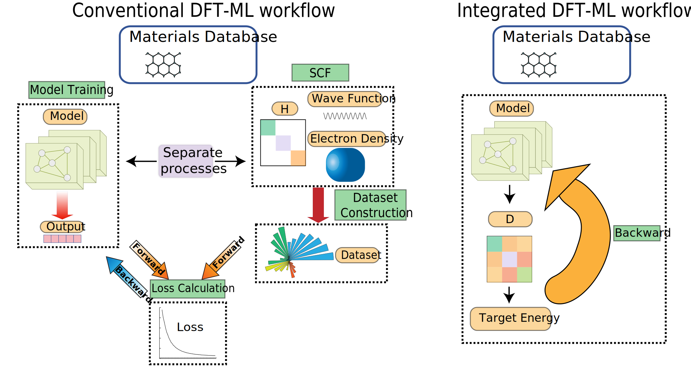

# Replication Materials for: Variational Machine Learning Model for Electronic Structure Optimization via the Density Matrix


This repository contains the reference implementation and reproduction scripts for the paper:

- **Title:** Variational Machine Learning Model for Electronic Structure Optimization via the Density Matrix
- **DOI:** [10.1103/wl9w-8g8r](https://doi.org/10.1103/wl9w-8g8r)

---

## ⚠️ Note on Code Status

**Current Version: Research Prototype (v0.1)**

Please note that the code provided here is the **raw research code** used to generate the results presented in the manuscript. To ensure full transparency and immediate reproducibility during the review process, we are releasing the code in its original state.

* **Functionality:** The code contains all core technical details and algorithms described in the paper.
* **Optimization:** This version is **not yet modularized or optimized** for performance (e.g., parallelization).
* **Roadmap:** A polished, modularized, and accelerated version (with parallel computing support) is currently under development and will be released upon the formal publication of the article.

## 📂 Repository Contents

This repository consists of two self-contained scripts. Each script corresponds to a specific system type discussed in the paper and includes a built-in test case for immediate verification.

### 1. `main.py` (Periodic Systems / DFT)
* **Description:** Implements the variational model for **Periodic Systems** within the Density Functional Theory (DFT) framework.
* **Test Case:** **Graphene**.
* **Function:** Running this script will demonstrate the electronic structure optimization of Graphene. It outputs a comparison between our variational method and the standard Self-Consistent Field (SCF) results, verifying the convergence and accuracy.

### 2. `HF_mole.py` (Molecular Systems / Hartree-Fock)
* **Description:** Implements the variational model for **Non-periodic (Isolated) Molecular Systems** within the Hartree-Fock (HF) framework. This is provided to demonstrate the method's universality across different electronic structure theories.
* **Test Case:** **Water Molecule (H₂O)**.
* **Function:** Running this script calculates the HF energy for a water molecule. It compares the results of our method against the standard SCF solution.

## 🛠️ Installation & Dependencies

Unlike standard scripts, this research code relies on a comprehensive set of Python libraries to perform complex electronic structure calculations (DFT and HF). **Correct environment setup is crucial for reproduction.**

We strongly recommend installing PyTorch *manually* first to match your hardware drivers, before installing the rest of the dependencies.

### 1. Install PyTorch (Crucial)
Please visit [pytorch.org](https://pytorch.org/get-started/locally/) to find the installation command compatible with your operating system and CUDA (GPU) version.

For example, for a standard **Linux/Windows** environment with **CUDA 12.1**, run:
```bash
pip install torch --index-url [https://download.pytorch.org/whl/cu121](https://download.pytorch.org/whl/cu121)
```

We have provided a `requirements.txt` file that aggregates the dependencies for both `main.py` (Periodic systems) and `HF_mole.py` (Molecular systems). Please ensure all packages are installed before running either script.

### Prerequisites
* **Python 3.8+** (Recommended)
* **OS:** Linux / macOS / Windows (Tested on Linux)

### Setup
1.  Clone the repository.
2.  Install all required dependencies using the provided file:

```bash
pip install -r requirements.txt
```

## 🚀 Getting Started

### Running the Reproduction

To reproduce the **Graphene results** (Periodic DFT):

```bash
python main.py
```

To reproduce the Water molecule results (Molecular HF):
```bash
python HF_mole.py
```

## 📜 Citation

If you find this code or our method useful, please cite our paper:

```bibtex
@article{DeepDM,
  title = {Variational Machine Learning Model for Electronic Structure Optimization via the Density Matrix},
  author = {Dong, Luqi and Yang, Shuxiang and Wei, Su-huai and Lu, Yunhao},
  journal = {Physical Review Letters},
  year = {2025},
  doi = {10.1103/wl9w-8g8r},
  url = {[https://doi.org/10.1103/wl9w-8g8r](https://doi.org/10.1103/wl9w-8g8r)}
}
